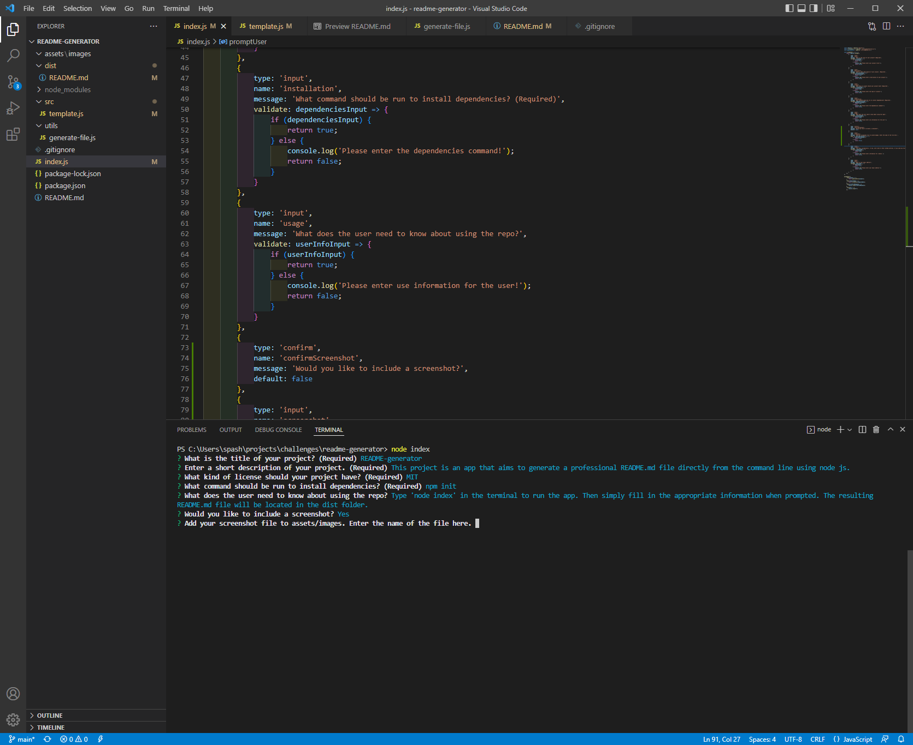

# README Generator

## Description

This project is an app that aims to generate a professional README.md file directly from the command line using node js.

## Table of Contents
- [Installation](#installation)
- [Usage](#usage)
- [Credits](#credits)
- [License](#license)

## Installation

npm init

## Usage

Type 'node index' in the terminal to run the app. Then simply fill in the appropriate information when prompted. The resulting README.md file will be located in the dist folder.

    

## Credits

I referenced this blog post on how to write a professional README.md file: https://coding-boot-camp.github.io/full-stack/github/professional-readme-guide

## License

This application is covered by the MIT license.

## Contributing

Contribute in any way you see fit.

## Tests

There are no tests included in this repository.

## Questions

If you have any additional questions please contact me at: burnbright987@gmail.com

https://github.com/KMAScott
    